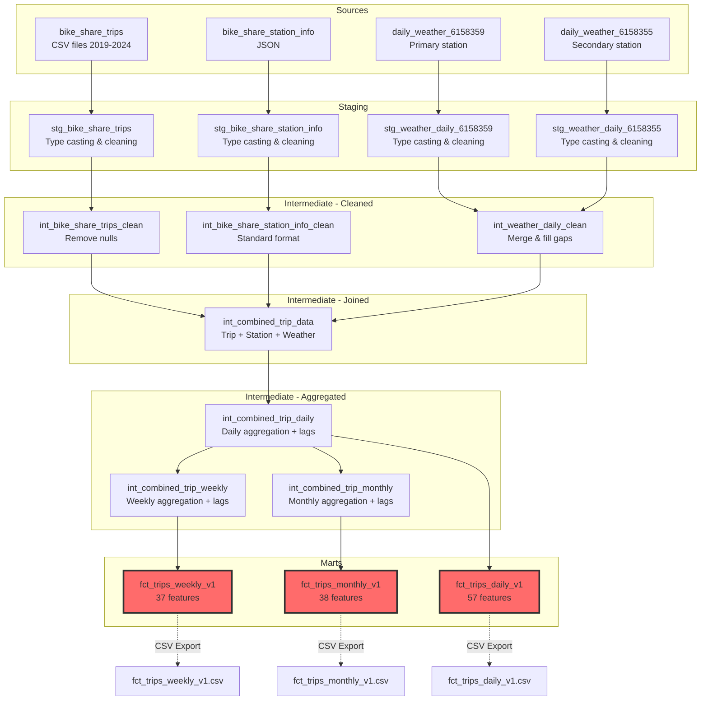

# Bike Share ML Data Pipeline Documentation (AI Generated)

**Version:** 1.0  
**Last Updated:** 2025-11-09  
**Purpose:** Time series forecasting of bike share demand

---

## Table of Contents

1. [Overview](#overview)
2. [Architecture](#architecture)
3. [Data Sources](#data-sources)
4. [Pipeline Layers](#pipeline-layers)
5. [Final Outputs](#final-outputs)
6. [Feature Engineering](#feature-engineering)
7. [Usage Guide](#usage-guide)

---

## Overview

This dbt project transforms raw bike share trip data and weather data into ML-ready time series datasets for demand forecasting. The pipeline follows a **medallion architecture** with four distinct layers:

- **Sources** → **Staging** → **Intermediate** → **Marts**

The final outputs are three versioned fact tables (`fct_trips_daily_v1`, `fct_trips_weekly_v1`, `fct_trips_monthly_v1`) that contain comprehensive features for training machine learning models to predict bike share demand at different time horizons.

### Key Statistics

- **Time Range:** 2019-2024 (6 years of data)
- **Daily Rows:** ~2,191 days
- **Weekly Rows:** ~313 weeks
- **Monthly Rows:** ~72 months
- **Features per Model:** 57 (daily), 37 (weekly), 38 (monthly)
- **Output Format:** DuckDB tables + CSV files

---

## Architecture

### High-Level Data Flow

```mermaid
graph LR
    A[Raw CSV Files] --> B[Sources]
    B --> C[Staging Layer]
    C --> D[Intermediate - Cleaned]
    D --> E[Intermediate - Joined]
    E --> F[Intermediate - Aggregated]
    F --> G[Marts - Time Series]
    G --> H[CSV Exports]

    style A fill:#f9f,stroke:#333
    style B fill:#bbf,stroke:#333
    style C fill:#bfb,stroke:#333
    style D fill:#ffd,stroke:#333
    style E fill:#ffd,stroke:#333
    style F fill:#ffd,stroke:#333
    style G fill:#f96,stroke:#333
    style H fill:#6f6,stroke:#333
```



### Detailed DAG Structure



---

## Data Sources

### 1. Bike Share Trip Data

- **Original Source:** [Toronto Open Data - Bike Share Toronto Ridership Data](https://open.toronto.ca/dataset/bike-share-toronto-ridership-data/)
- **Local Path:** `data/raw/bikeshare/trips/bikeshare-ridership-*/`
- **Format:** CSV files (one per year, 2019-2024)
- **Records:** ~10M+ trips
- **License:** Open Government Licence - Toronto
- **Key Fields:**
  - `Trip Id` - Unique identifier
  - `Start/End Time` - Timestamps
  - `Start/End Station Id` - Station identifiers
  - `Trip Duration` - Duration in seconds
  - `User Type` - Annual Member or Casual Member
  - `Bike Id` - Bike identifier

### 2. Station Information

- **Original Source:** [Toronto Open Data - Bike Share Toronto](https://open.toronto.ca/dataset/bike-share-toronto/)
- **Local Path:** `data/raw/bikeshare/station_info/station_info_extracted.json`
- **Format:** JSON
- **Records:** ~800 stations
- **License:** Open Government Licence - Toronto
- **Preprocessing:** Extracted from original JSON using `jq '.data[]' station_info.json > station_info_extracted.json` to flatten structure for easier DuckDB loading
- **Key Fields:**
  - Station ID, name, address
  - Latitude, longitude
  - Capacity
  - Physical configuration
  - Rental methods

### 3. Weather Data

#### Primary Weather Station (6158359)

- **Original Source:** [Environment Canada - Toronto City Centre](https://climate.weather.gc.ca/climate_data/daily_data_e.html?hlyRange=2009-12-10%7C2025-11-07&dlyRange=2010-02-02%7C2025-11-07&mlyRange=%7C&StationID=48549&Prov=ON&urlExtension=_e.html&searchType=stnProx&optLimit=specDate&StartYear=1840&EndYear=2016&selRowPerPage=25&Line=1&txtRadius=25&optProxType=navLink&txtLatDecDeg=43.666666666667&txtLongDecDeg=-79.4&timeframe=2&Day=1&Year=2024&Month=1#)
- **Station ID:** 6158359 (Toronto City Centre - YTZ)
- **Location:** 43°37'39"N, 79°23'46"W
- **Local Path:** `data/raw/weather/6158359/daily/`

#### Secondary Weather Station (6158355)

- **Original Source:** [Environment Canada - Toronto](https://climate.weather.gc.ca/climate_data/daily_data_e.html?hlyRange=2002-06-04%7C2025-11-07&dlyRange=2002-06-04%7C2025-11-07&mlyRange=2003-07-01%7C2006-12-01&StationID=31688&Prov=ON&urlExtension=_e.html&searchType=stnName&optLimit=yearRange&StartYear=2016&EndYear=2025&selRowPerPage=25&Line=3&searchMethod=contains&txtStationName=toronto&timeframe=2&Day=7&Year=2024&Month=1#)
- **Station ID:** 6158355
- **Usage:** Backup for filling gaps in primary station data
- **Local Path:** `data/raw/weather/6158355/daily/`

**Weather Format Details:**

- **Format:** CSV files (one per year)
- **Key Fields:**
  - Date/Time
  - Max/Min/Mean Temperature (°C)
  - Station location
  - Precipitation data

---

## Pipeline Layers

### Layer 1: Staging (`stg_*`)

**Purpose:** Type casting and basic cleaning of raw data

**Models:**

- `stg_bike_share_trips.sql` - Type cast trip columns, convert to snake_case
- `stg_bike_share_station_info.sql` - Parse JSON, type cast station fields
- `stg_weather_daily_6158359.sql` - Type cast weather data (primary)
- `stg_weather_daily_6158355.sql` - Type cast weather data (secondary)

**Transformations:**

- Column name standardization (spaces → snake_case)
- Type casting using `::` syntax
- No business logic or filtering
- Materialized as **views**

**Example:**

```sql
select
    "Trip Id"::bigint as trip_id,
    "Start Time"::timestamp as start_time,
    "User Type"::varchar as user_type
from {{ source('bikeshare', 'bike_share_trips') }}
```

---

### Layer 2: Intermediate - Cleaned (`int_*_clean`)

**Purpose:** Apply business logic and data quality rules

#### `int_bike_share_trips_clean`

- Filter out trips with null duration
- Trips without duration are same start/end station and time → invalid

#### `int_bike_share_station_info_clean`

- Standardize station information
- No additional filtering (all stations valid)

#### `int_weather_daily_clean`

- **Merge** two weather stations (primary → secondary fallback)
- **Fill gaps** in missing days using interpolation
- Formula: `(previous_day + next_day) / 2`
- Ensures continuous daily weather data

**Materialized as:** Tables

---

### Layer 3: Intermediate - Joined (`int_combined_trip_data`)

**Purpose:** Combine all data sources into a single denormalized table

**Join Strategy:**

```sql
trips
LEFT JOIN start_station_info ON trips.start_station_id = station.station_id
LEFT JOIN end_station_info ON trips.end_station_id = station.station_id
LEFT JOIN weather ON trips.start_time::date = weather.date_time::date
```

**Result:** Trip-level data with 41 columns including:

- Trip details (ID, duration, timestamps)
- Start station details (name, location, capacity, etc.)
- End station details (name, location, capacity, etc.)
- Weather data (temperatures for that day)

**Materialized as:** Table  
**Row Count:** ~10M trips

---

### Layer 4: Intermediate - Aggregated (`int_combined_trip_*`)

**Purpose:** Create time series aggregations with ML features

This is where the **feature engineering** happens!

#### `int_combined_trip_daily` (57 columns)

- **Grain:** One row per date
- **Aggregations:** Daily trip counts, durations, user mix, station activity
- **Lags:** 1d, 2d, 3d, 7d, 30d
- **Rolling windows:** 7-day, 30-day averages and std dev

#### `int_combined_trip_weekly` (37 columns)

- **Grain:** One row per week (Monday start)
- **Aggregations:** Weekly totals from daily data
- **Lags:** 1w, 4w, 12w, 52w
- **Rolling windows:** 4-week, 12-week, 52-week averages

#### `int_combined_trip_monthly` (38 columns)

- **Grain:** One row per month
- **Aggregations:** Monthly totals from daily data
- **Lags:** 1m, 3m, 12m
- **Rolling windows:** 3-month, 6-month, 12-month averages

**Materialized as:** Tables

---

### Layer 5: Marts (`fct_trips_*_v1`)

**Purpose:** Production-ready datasets for ML modeling

**Models:**

- `fct_trips_daily_v1` - Daily time series with 57 features
- `fct_trips_weekly_v1` - Weekly time series with 37 features
- `fct_trips_monthly_v1` - Monthly time series with 38 features

**Characteristics:**

- Explicit column selection (no `SELECT *`)
- Comprehensive documentation in YML files
- Versioned (`_v1` suffix) for future iterations
- **Automatic CSV export** via post-hooks
- Data quality tests (not_null, unique on keys)

**Materialized as:** Tables + CSV files

---

## Final Outputs

### 1. Daily Facts Table (`fct_trips_daily_v1`)

**Grain:** One row per date  
**Date Range:** 2019-01-01 to 2024-12-31  
**Rows:** ~2,191  
**Columns:** 57

#### Column Categories

**Primary Key:**

- `trip_date` (date)

**Date & Time Features (8 columns, non-leaky):**

- `day_of_week`, `day_name`, `is_weekend`
- `month_num`, `year`, `day_of_month`, `week_of_year`

**Trip Volume Features (7 columns, LEAKY):**

- `total_trips__leaky` - Total trips for the day
- `annual_member_trips__leaky`, `casual_member_trips__leaky`
- `annual_member_ratio__leaky` - % of trips by annual members
- `unique_bikes__leaky`, `unique_start_stations__leaky`, `unique_end_stations__leaky`

**Trip Duration Features (9 columns, LEAKY):**

- `avg_trip_duration__leaky`, `median_trip_duration__leaky`
- `min_trip_duration__leaky`, `max_trip_duration__leaky`
- `stddev_trip_duration__leaky`
- `p25_trip_duration__leaky`, `p75_trip_duration__leaky` (percentiles)
- `avg_annual_member_duration__leaky`, `avg_casual_member_duration__leaky`

**Weather Features (4 columns, non-leaky):**

- `max_temp_c`, `min_temp_c`, `mean_temp_c`, `temp_range_c`

**Station Activity Features (4 columns, LEAKY):**

- `top_start_station_id__leaky`, `top_start_station_trips__leaky`
- `top_end_station_id__leaky`, `top_end_station_trips__leaky`

**Trip Volume Lags (9 columns, non-leaky):**

- `trips_lag_1d`, `trips_lag_2d`, `trips_lag_3d`, `trips_lag_7d`, `trips_lag_30d`
- `trips_rolling_7d_avg`, `trips_rolling_7d_std`
- `trips_rolling_30d_avg`, `trips_rolling_30d_std`

**User Mix Lags (5 columns, non-leaky):**

- `annual_member_ratio_lag_1d`, `annual_member_ratio_lag_7d`
- `annual_member_ratio_rolling_7d_avg`
- `annual_member_trips_lag_7d`, `casual_member_trips_lag_7d`

**Duration Lags (4 columns, non-leaky):**

- `avg_trip_duration_lag_1d`, `avg_trip_duration_lag_7d`
- `avg_trip_duration_rolling_7d_avg`, `avg_trip_duration_rolling_30d_avg`

**Network Activity Lags (5 columns, non-leaky):**

- `unique_bikes_lag_1d`, `unique_bikes_lag_7d`
- `unique_start_stations_lag_1d`, `unique_start_stations_lag_7d`
- `unique_start_stations_rolling_30d_avg`

**Change Indicators (3 columns, non-leaky):**

- `trips_change_1d_pct` - Day-over-day % change
- `trips_change_7d_pct` - Week-over-week % change
- `trips_change_30d_pct` - Month-over-month % change

---

### 2. Weekly Facts Table (`fct_trips_weekly_v1`)

**Grain:** One row per week (Monday-Sunday)  
**Date Range:** 2019 to 2024  
**Rows:** ~313  
**Columns:** 37

Similar structure to daily but with:

- Weekly aggregations (sums, averages)
- Lags: 1w, 4w, 12w, 52w
- Rolling windows: 4-week, 12-week, 52-week
- `days_in_week` - Quality check (should be 7)

---

### 3. Monthly Facts Table (`fct_trips_monthly_v1`)

**Grain:** One row per month  
**Date Range:** 2019-01 to 2024-12  
**Rows:** ~72  
**Columns:** 38

Similar structure to daily/weekly but with:

- Monthly aggregations
- Additional field: `quarter` (1-4)
- Lags: 1m, 3m, 12m
- Rolling windows: 3-month, 6-month, 12-month
- `days_in_month` - Quality check (varies by month)

---

## Feature Engineering

### Leaky vs Non-Leaky Features

**LEAKY Features (suffix: `__leaky`):**

- These contain information from the current period
- Cannot be used as model inputs for forecasting
- **Use as:** Training labels/targets
- Examples: `total_trips__leaky`, `avg_trip_duration__leaky`

**NON-LEAKY Features (no suffix):**

- Only contain information from past periods
- Safe to use as model inputs
- **Use as:** Model features/predictors
- Examples: `trips_lag_7d`, `trips_rolling_30d_avg`, `weather`, `day_of_week`

### Lag Features Explained

Lag features let the model "remember" patterns:

**Simple Lags:**

```
trips_lag_1d = total_trips from 1 day ago
trips_lag_7d = total_trips from 7 days ago
```

**Rolling Averages:**

```
trips_rolling_7d_avg = average of last 7 days (including today)
trips_rolling_30d_avg = average of last 30 days
```

**Change Indicators:**

```
trips_change_1d_pct = ((today - yesterday) / yesterday) * 100
trips_change_7d_pct = ((today - same_day_last_week) / same_day_last_week) * 100
```

### Why Multiple Time Granularities?

Different models for different forecasting horizons:

| Model   | Best For              | Prediction Window        |
| ------- | --------------------- | ------------------------ |
| Daily   | Short-term forecasts  | Tomorrow, next 7 days    |
| Weekly  | Medium-term forecasts | Next month, next quarter |
| Monthly | Long-term forecasts   | Next quarter, next year  |

---

## Usage Guide

### Building the Pipeline

```bash
# Navigate to dbt project
cd dag

# Build everything
dbt run

# Build specific layers
dbt run -s staging.*
dbt run -s intermediate.*
dbt run -s marts.*

# Build specific models
dbt run -s fct_trips_daily_v1
dbt run -s fct_trips_weekly_v1
dbt run -s fct_trips_monthly_v1
```

### Accessing the Data

#### Option 1: Query DuckDB directly

```python
import duckdb

conn = duckdb.connect('../data/processed/dev.duckdb')

# Query daily data
df_daily = conn.execute("""
    SELECT * FROM fct_trips_daily_v1
    WHERE trip_date >= '2024-01-01'
    ORDER BY trip_date
""").df()

conn.close()
```

#### Option 2: Load CSV files

```python
import pandas as pd

# Load exported CSV
df_daily = pd.read_csv('../data/processed/marts/time_series/fct_trips_daily_v1.csv')
df_weekly = pd.read_csv('../data/processed/marts/time_series/fct_trips_weekly_v1.csv')
df_monthly = pd.read_csv('../data/processed/marts/time_series/fct_trips_monthly_v1.csv')
```

### Example ML Workflow

```python
import pandas as pd
from sklearn.model_selection import train_test_split
from sklearn.ensemble import RandomForestRegressor

# Load daily data
df = pd.read_csv('data/processed/marts/time_series/fct_trips_daily_v1.csv')

# Separate features and target
# IMPORTANT: Only use non-leaky columns as features!
feature_cols = [col for col in df.columns if '__leaky' not in col and col != 'trip_date']
target_col = 'total_trips__leaky'

# Remove rows with NaN in lag features (first 30 days)
df_clean = df.dropna()

X = df_clean[feature_cols]
y = df_clean[target_col]

# Time-based split (don't shuffle!)
X_train, X_test, y_train, y_test = train_test_split(
    X, y, test_size=0.2, shuffle=False
)

# Train model
model = RandomForestRegressor(n_estimators=100, random_state=42)
model.fit(X_train, y_train)

# Evaluate
score = model.score(X_test, y_test)
print(f"R² Score: {score:.3f}")
```

---

## Data Quality

### Tests Applied

- **Not Null:** All non-lag columns must have values
- **Unique:** Primary keys (dates) must be unique
- **Relationships:** All intermediate tables maintain referential integrity

### Known Data Gaps

- **Lag features:** First N rows will have NULLs (e.g., first 30 days have no 30-day lag)
- **User type averages:** Days with no annual members or casual members will have NULL averages
- **Standard deviation:** Days with only 1 trip will have NULL stddev

---

## Change Log

### Version 1.0 (2025-11-09)

- Initial release
- Daily, weekly, and monthly aggregations
- 57/37/38 features respectively
- Comprehensive lag features for time series
- CSV export functionality
- Full documentation

---

## Contact

For questions about this dataset or the pipeline:

- Check model YML files for column-level documentation
- Review SQL files for transformation logic
- See dbt docs: `dbt docs generate && dbt docs serve`

---

## Appendix: Quick Reference

### File Locations

**Raw Data:**

- Trips: `data/raw/bikeshare/trips/`
- Stations: `data/raw/bikeshare/station_info/`
- Weather: `data/raw/weather/*/daily/`

**DuckDB Database:**

- `data/processed/dev.duckdb`

**CSV Exports:**

- `data/processed/marts/time_series/fct_trips_daily_v1.csv`
- `data/processed/marts/time_series/fct_trips_weekly_v1.csv`
- `data/processed/marts/time_series/fct_trips_monthly_v1.csv`

### dbt Model Dependencies

```
Sources (4) → Staging (4) → Cleaned (3) → Joined (1) → Aggregated (3) → Marts (3)
```

### Column Count by Model

| Model   | Total Cols | Leaky | Non-Leaky | Lag Features |
| ------- | ---------- | ----- | --------- | ------------ |
| Daily   | 57         | 24    | 33        | 26           |
| Weekly  | 37         | 13    | 24        | 14           |
| Monthly | 38         | 13    | 25        | 14           |
