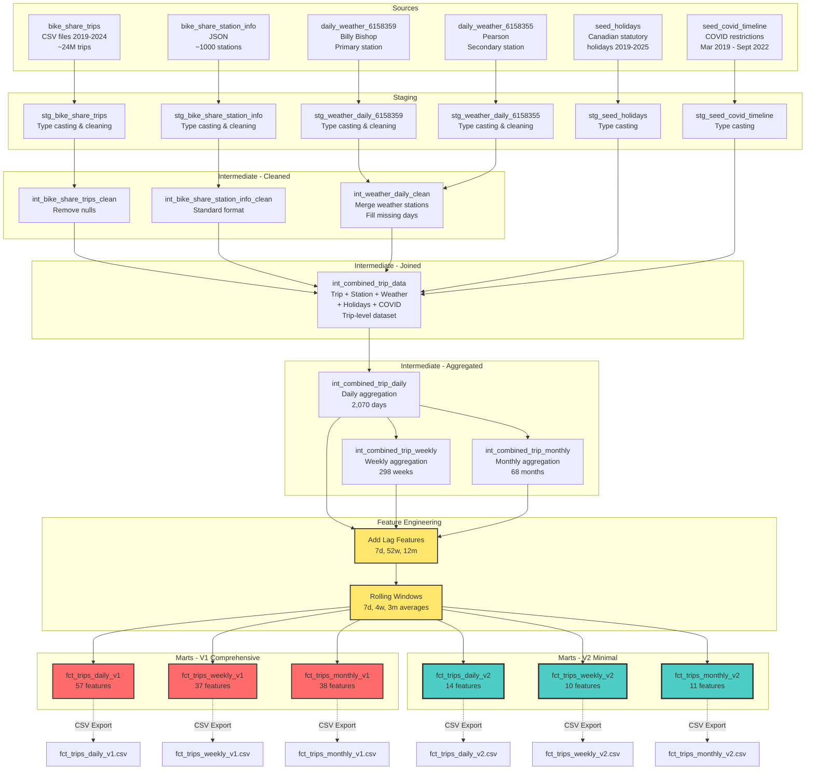

# Bike Share ML Data Pipeline Documentation (AI Generated)

**Version:** 2.0  
**Last Updated:** 2025-11-30  
**Purpose:** Time series forecasting of bike share demand

---

## Table of Contents

1. [Overview](#overview)
2. [Architecture](#architecture)
3. [Data Sources](#data-sources)
4. [Pipeline Layers](#pipeline-layers)
5. [Final Outputs](#final-outputs)
6. [Feature Engineering](#feature-engineering)
7. [Usage Guide](#usage-guide)

---

## Overview

This dbt project transforms raw bike share trip data, weather data, holiday information, and COVID-19 timeline data into ML-ready time series datasets for demand forecasting. The pipeline follows a **medallion architecture** with four distinct layers:

- **Sources** → **Staging** → **Intermediate** → **Marts**

The final outputs are **two versions** of fact tables at three time granularities:

- **Version 1 (v1):** Comprehensive feature set with extensive lag and rolling features
- **Version 2 (v2):** Minimal, curated feature set for simplified modeling

### Key Statistics

- **Time Range:** 2019-2024 (6 years of data)
- **Daily Rows:** ~2,191 days
- **Weekly Rows:** ~313 weeks
- **Monthly Rows:** ~72 months

**Version 1 Features:**

- Daily: 57 features (comprehensive)
- Weekly: 37 features
- Monthly: 38 features

**Version 2 Features (Simplified):**

- Daily: 14 features (minimal)
- Weekly: 10 features
- Monthly: 11 features

- **Output Format:** DuckDB tables + CSV files

---

## Architecture

### High-Level Data Flow


### Detailed DAG Structure



---

## Data Sources

### 1. Bike Share Trip Data

- **Original Source:** [Toronto Open Data - Bike Share Toronto Ridership Data](https://open.toronto.ca/dataset/bike-share-toronto-ridership-data/)
- **Local Path:** `data/raw/bikeshare/trips/bikeshare-ridership-*/`
- **Format:** CSV files (one per year, 2019-2024)
- **Records:** ~10M+ trips
- **License:** Open Government Licence - Toronto
- **Key Fields:**
  - `Trip Id` - Unique identifier
  - `Start/End Time` - Timestamps
  - `Start/End Station Id` - Station identifiers
  - `Trip Duration` - Duration in seconds
  - `User Type` - Annual Member or Casual Member
  - `Bike Id` - Bike identifier

### 2. Station Information

- **Original Source:** [Toronto Open Data - Bike Share Toronto](https://open.toronto.ca/dataset/bike-share-toronto/)
- **Local Path:** `data/raw/bikeshare/station_info/station_info_extracted.json`
- **Format:** JSON
- **Records:** ~800 stations
- **License:** Open Government Licence - Toronto
- **Preprocessing:** Extracted from original JSON using `jq '.data[]' station_info.json > station_info_extracted.json` to flatten structure for easier DuckDB loading
- **Key Fields:**
  - Station ID, name, address
  - Latitude, longitude
  - Capacity
  - Physical configuration
  - Rental methods

### 3. Weather Data

#### Primary Weather Station (6158359 - Billy Bishop)

- **Original Source:** [Environment Canada - Toronto City Centre](https://climate.weather.gc.ca/climate_data/daily_data_e.html?hlyRange=2009-12-10%7C2025-11-07&dlyRange=2010-02-02%7C2025-11-07&mlyRange=%7C&StationID=48549&Prov=ON&urlExtension=_e.html&searchType=stnProx&optLimit=specDate&StartYear=1840&EndYear=2016&selRowPerPage=25&Line=1&txtRadius=25&optProxType=navLink&txtLatDecDeg=43.666666666667&txtLongDecDeg=-79.4&timeframe=2&Day=1&Year=2024&Month=1#)
- **Station ID:** 6158359 (Toronto City Centre - Billy Bishop Airport/YTZ)
- **Location:** 43°37'39"N, 79°23'46"W
- **Local Path:** `data/raw/weather/6158359/daily/`

#### Secondary Weather Station (6158355 - Pearson)

- **Original Source:** [Environment Canada - Toronto](https://climate.weather.gc.ca/climate_data/daily_data_e.html?hlyRange=2002-06-04%7C2025-11-07&dlyRange=2002-06-04%7C2025-11-07&mlyRange=2003-07-01%7C2006-12-01&StationID=31688&Prov=ON&urlExtension=_e.html&searchType=stnName&optLimit=yearRange&StartYear=2016&EndYear=2025&selRowPerPage=25&Line=3&searchMethod=contains&txtStationName=toronto&timeframe=2&Day=7&Year=2024&Month=1#)
- **Station ID:** 6158355 (Pearson Airport)
- **Usage:** Backup for filling gaps in primary station data
- **Local Path:** `data/raw/weather/6158355/daily/`

**Weather Format Details:**

- **Format:** CSV files (one per year)
- **Key Fields:**
  - Date/Time
  - Max/Min/Mean Temperature (°C)
  - Total Precipitation (mm)
  - Station location

### 4. Canadian Holidays

- **Original Source:** Manually curated list of Canadian statutory holidays
- **Local Path:** `dag/seeds/seed_holidays.csv`
- **Format:** CSV seed file (managed within dbt)
- **Time Range:** 2019-2025
- **Key Fields:**
  - `holiday_name` - Name of the holiday
  - `date_string` - Date in string format
  - `holiday_date` - Parsed date
- **Purpose:** Feature engineering to identify holiday effects on bike share demand

### 5. COVID-19 Timeline

- **Original Source:** Manually curated COVID-19 restrictions timeline for Toronto
- **Local Path:** `dag/seeds/seed_covid_timeline.csv`
- **Format:** CSV seed file (managed within dbt)
- **Time Range:** March 2019 - September 2022
- **Key Fields:**
  - `report_date` - Date of the record
  - `restrictions` - Boolean flag indicating if restrictions were in place
  - `hospitalizations`, `icu_admissions`, `inhospital_deaths`, `ed_visits` - Health metrics
- **Purpose:** Feature engineering to account for pandemic impact on ridership patterns

---

## Pipeline Layers

### Layer 1: Staging (`stg_*`)

**Purpose:** Type casting and basic cleaning of raw data

**Models:**

- `stg_bike_share_trips.sql` - Type cast trip columns, convert to snake_case
- `stg_bike_share_station_info.sql` - Parse JSON, type cast station fields
- `stg_weather_daily_6158359.sql` - Type cast weather data (primary)
- `stg_weather_daily_6158355.sql` - Type cast weather data (secondary)
- `stg_seed_holidays.sql` - Type cast holiday dates from seed file
- `stg_seed_covid_timeline.sql` - Type cast COVID timeline from seed file

**Transformations:**

- Column name standardization (spaces → snake_case)
- Type casting using `::` syntax
- No business logic or filtering
- Materialized as **views**

**Seed Files:**

dbt seed files (`dag/seeds/`) are CSV files managed within the dbt project. They are loaded into the database using `dbt seed` command and then referenced in staging models.

**Example:**

```sql
select
    "Trip Id"::bigint as trip_id,
    "Start Time"::timestamp as start_time,
    "User Type"::varchar as user_type
from {{ source('bikeshare', 'bike_share_trips') }}
```

---

### Layer 2: Intermediate - Cleaned (`int_*_clean`)

**Purpose:** Apply business logic and data quality rules

#### `int_bike_share_trips_clean`

- Filter out trips with null duration
- Trips without duration are same start/end station and time → invalid

#### `int_bike_share_station_info_clean`

- Standardize station information
- No additional filtering (all stations valid)

#### `int_weather_daily_clean`

- **Merge** two weather stations (primary → secondary fallback)
- **Fill gaps** in missing days using interpolation
- Formula: `(previous_day + next_day) / 2`
- Ensures continuous daily weather data

**Materialized as:** Tables

---

### Layer 3: Intermediate - Joined (`int_combined_trip_data`)

**Purpose:** Combine all data sources into a single denormalized table

**Join Strategy:**

```sql
trips
LEFT JOIN start_station_info ON trips.start_station_id = station.station_id
LEFT JOIN end_station_info ON trips.end_station_id = station.station_id
LEFT JOIN weather ON trips.start_time::date = weather.date_time::date
LEFT JOIN holidays ON trips.start_time::date = holidays.holiday_date
LEFT JOIN covid_timeline ON trips.start_time::date = covid_timeline.report_date
```

**Result:** Trip-level data with enriched columns including:

- Trip details (ID, duration, timestamps)
- Start station details (name, location, capacity, etc.)
- End station details (name, location, capacity, etc.)
- Weather data (temperatures, precipitation for that day)
- Holiday indicator (boolean flag)
- COVID restriction indicator (boolean flag)

**Materialized as:** Table  
**Row Count:** ~10M+ trips

---

### Layer 4: Intermediate - Aggregated (`int_combined_trip_*`)

**Purpose:** Create time series aggregations with ML features

This is where the **feature engineering** happens!

#### `int_combined_trip_daily` (57 columns)

- **Grain:** One row per date
- **Aggregations:** Daily trip counts, durations, user mix, station activity
- **Lags:** 1d, 2d, 3d, 7d, 30d
- **Rolling windows:** 7-day, 30-day averages and std dev

#### `int_combined_trip_weekly` (37 columns)

- **Grain:** One row per week (Monday start)
- **Aggregations:** Weekly totals from daily data
- **Lags:** 1w, 4w, 12w, 52w
- **Rolling windows:** 4-week, 12-week, 52-week averages

#### `int_combined_trip_monthly` (38 columns)

- **Grain:** One row per month
- **Aggregations:** Monthly totals from daily data
- **Lags:** 1m, 3m, 12m
- **Rolling windows:** 3-month, 6-month, 12-month averages

**Materialized as:** Tables

---

### Layer 5: Marts (`fct_trips_*`)

**Purpose:** Production-ready datasets for ML modeling

**Two Versions Available:**

#### Version 1 (v1) - Comprehensive Feature Set

- `fct_trips_daily_v1` - Daily time series with 57 features
- `fct_trips_weekly_v1` - Weekly time series with 37 features
- `fct_trips_monthly_v1` - Monthly time series with 38 features

**Use case:** Exploratory analysis, feature selection, comprehensive modeling

#### Version 2 (v2) - Minimal Feature Set

- `fct_trips_daily_v2` - Daily time series with 14 features
- `fct_trips_weekly_v2` - Weekly time series with 10 features
- `fct_trips_monthly_v2` - Monthly time series with 11 features

**Use case:** Production modeling, simplified feature engineering, baseline models

**Characteristics:**

- Explicit column selection (no `SELECT *`)
- Comprehensive documentation in YML files
- Versioned (suffix) for future iterations
- **Automatic CSV export** via post-hooks
- Data quality tests (not_null, unique on keys)
- V2 includes holiday and COVID restriction features not in V1

**Materialized as:** Tables + CSV files

---

## Final Outputs

### 1. Daily Facts Table (`fct_trips_daily_v1`)

**Grain:** One row per date  
**Date Range:** 2019-01-01 to 2024-12-31  
**Rows:** ~2,191  
**Columns:** 57

#### Column Categories

**Primary Key:**

- `trip_date` (date)

**Date & Time Features (8 columns, non-leaky):**

- `day_of_week`, `day_name`, `is_weekend`
- `month_num`, `year`, `day_of_month`, `week_of_year`

**Trip Volume Features (7 columns, LEAKY):**

- `total_trips__leaky` - Total trips for the day
- `annual_member_trips__leaky`, `casual_member_trips__leaky`
- `annual_member_ratio__leaky` - % of trips by annual members
- `unique_bikes__leaky`, `unique_start_stations__leaky`, `unique_end_stations__leaky`

**Trip Duration Features (9 columns, LEAKY):**

- `avg_trip_duration__leaky`, `median_trip_duration__leaky`
- `min_trip_duration__leaky`, `max_trip_duration__leaky`
- `stddev_trip_duration__leaky`
- `p25_trip_duration__leaky`, `p75_trip_duration__leaky` (percentiles)
- `avg_annual_member_duration__leaky`, `avg_casual_member_duration__leaky`

**Weather Features (4 columns, non-leaky):**

- `max_temp_c`, `min_temp_c`, `mean_temp_c`, `temp_range_c`

**Station Activity Features (4 columns, LEAKY):**

- `top_start_station_id__leaky`, `top_start_station_trips__leaky`
- `top_end_station_id__leaky`, `top_end_station_trips__leaky`

**Trip Volume Lags (9 columns, non-leaky):**

- `trips_lag_1d`, `trips_lag_2d`, `trips_lag_3d`, `trips_lag_7d`, `trips_lag_30d`
- `trips_rolling_7d_avg`, `trips_rolling_7d_std`
- `trips_rolling_30d_avg`, `trips_rolling_30d_std`

**User Mix Lags (5 columns, non-leaky):**

- `annual_member_ratio_lag_1d`, `annual_member_ratio_lag_7d`
- `annual_member_ratio_rolling_7d_avg`
- `annual_member_trips_lag_7d`, `casual_member_trips_lag_7d`

**Duration Lags (4 columns, non-leaky):**

- `avg_trip_duration_lag_1d`, `avg_trip_duration_lag_7d`
- `avg_trip_duration_rolling_7d_avg`, `avg_trip_duration_rolling_30d_avg`

**Network Activity Lags (5 columns, non-leaky):**

- `unique_bikes_lag_1d`, `unique_bikes_lag_7d`
- `unique_start_stations_lag_1d`, `unique_start_stations_lag_7d`
- `unique_start_stations_rolling_30d_avg`

**Change Indicators (3 columns, non-leaky):**

- `trips_change_1d_pct` - Day-over-day % change
- `trips_change_7d_pct` - Week-over-week % change
- `trips_change_30d_pct` - Month-over-month % change

---

### 2. Weekly Facts Table (`fct_trips_weekly_v1`)

**Grain:** One row per week (Monday-Sunday)  
**Date Range:** 2019 to 2024  
**Rows:** ~313  
**Columns:** 37

Similar structure to daily but with:

- Weekly aggregations (sums, averages)
- Lags: 1w, 4w, 12w, 52w
- Rolling windows: 4-week, 12-week, 52-week
- `days_in_week` - Quality check (should be 7)

---

### 3. Monthly Facts Table (`fct_trips_monthly_v1`)

**Grain:** One row per month  
**Date Range:** 2019-01 to 2024-12  
**Rows:** ~72  
**Columns:** 38

Similar structure to daily/weekly but with:

- Monthly aggregations
- Additional field: `quarter` (1-4)
- Lags: 1m, 3m, 12m
- Rolling windows: 3-month, 6-month, 12-month
- `days_in_month` - Quality check (varies by month)

---

## Version 2 (Simplified) Outputs

Version 2 provides a **minimal, curated feature set** designed for production modeling with reduced complexity. These datasets include holiday and COVID-19 restriction features not available in v1.

### 1. Daily Facts Table (`fct_trips_daily_v2`)

**Grain:** One row per date  
**Date Range:** 2019-01-01 to 2024-12-31  
**Rows:** ~2,191  
**Columns:** 14

#### Column Categories

**Primary Key:**

- `trip_date` (date)

**Date & Time Features (9 columns, non-leaky):**

- `day_of_week`, `day_name`, `is_weekend`
- `is_holiday` - Canadian statutory holiday flag **[NEW IN V2]**
- `has_covid_restrictions` - COVID-19 restrictions flag **[NEW IN V2]**
- `month_num`, `year`, `day_of_month`, `week_of_year`

**Target Variables (2 columns, LEAKY):**

- `total_trips__leaky` - Total trips for the day
- `avg_trip_duration__leaky` - Average trip duration in seconds

**Weather Features (2 columns, non-leaky):**

- `mean_temp_c` - Mean temperature in Celsius
- `total_precip_mm` - Total precipitation in millimeters **[NEW IN V2]**

**Trip Volume Lags (2 columns, non-leaky):**

- `trips_lag_7d` - Total trips from 7 days ago
- `trips_rolling_7d_avg` - Rolling 7-day average (excluding current day)

**User Mix Lags (1 column, non-leaky):**

- `annual_member_ratio_lag_7d` - Ratio from 7 days ago

---

### 2. Weekly Facts Table (`fct_trips_weekly_v2`)

**Grain:** One row per week (Monday-Sunday)  
**Date Range:** 2019 to 2024  
**Rows:** ~313  
**Columns:** 10

**Primary Key:**

- `week_start_date` (timestamp)

**Time Features (4 columns, non-leaky):**

- `year`, `week_of_year`, `month_num`
- `days_in_week` - Number of distinct days (typically 7)
- `non_working_day_ratio` - Ratio of weekends + holidays **[NEW IN V2]**
- `has_covid_restrictions` - COVID flag for any day in week **[NEW IN V2]**

**Target Variables (2 columns, LEAKY):**

- `total_trips__leaky`, `avg_trip_duration__leaky`

**Weather Features (2 columns, non-leaky):**

- `avg_mean_temp_c`, `avg_total_precip_mm`

**Trip Volume Lags (2 columns, non-leaky):**

- `trips_lag_52w` - Total trips from 52 weeks ago (year-over-year)
- `trips_rolling_4w_avg` - Rolling 4-week average

---

### 3. Monthly Facts Table (`fct_trips_monthly_v2`)

**Grain:** One row per month  
**Date Range:** 2019-01 to 2024-12  
**Rows:** ~72  
**Columns:** 11

**Primary Key:**

- `month_start_date` (timestamp)

**Time Features (5 columns, non-leaky):**

- `year`, `month_num`, `month_name`, `quarter`
- `days_in_month` - Number of distinct days
- `non_working_day_ratio` - Ratio of weekends + holidays **[NEW IN V2]**
- `has_covid_restrictions` - COVID flag for any day in month **[NEW IN V2]**

**Target Variables (2 columns, LEAKY):**

- `total_trips__leaky`, `avg_trip_duration__leaky`

**Weather Features (2 columns, non-leaky):**

- `avg_mean_temp_c`, `avg_total_precip_mm`

**Trip Volume Lags (2 columns, non-leaky):**

- `trips_lag_12m` - Total trips from 12 months ago (year-over-year)
- `trips_rolling_3m_avg` - Rolling 3-month average

---

## Feature Engineering

### Two Feature Set Approaches

**Version 1 (Comprehensive):**

- Extensive feature engineering with many lag windows
- Multiple rolling averages and standard deviations
- Suitable for feature selection and exploration
- Risk of overfitting with smaller datasets

**Version 2 (Minimal):**

- Focused set of proven predictive features
- Includes contextual features (holidays, COVID)
- Simplified lag structure (single lag + rolling average)
- Better for production and baseline models

### Leaky vs Non-Leaky Features

**LEAKY Features (suffix: `__leaky`):**

- These contain information from the current period
- Cannot be used as model inputs for forecasting
- **Use as:** Training labels/targets
- Examples: `total_trips__leaky`, `avg_trip_duration__leaky`

**NON-LEAKY Features (no suffix):**

- Only contain information from past periods
- Safe to use as model inputs
- **Use as:** Model features/predictors
- Examples: `trips_lag_7d`, `trips_rolling_7d_avg`, `weather`, `day_of_week`, `is_holiday`, `has_covid_restrictions`

### V2 Feature Highlights

**Holiday Effects:**

- `is_holiday` captures Canadian statutory holidays (New Year's Day, Canada Day, etc.)
- Helps model understand reduced weekday ridership on holidays

**COVID-19 Impact:**

- `has_covid_restrictions` tracks periods with lockdowns/restrictions (Mar 2020 - Sep 2022)
- Accounts for unprecedented demand patterns during pandemic

**Precipitation Data:**

- `total_precip_mm` replaces temperature range as a weather predictor
- More directly correlated with ridership (rain = fewer riders)

**Non-Working Day Ratio:**

- Aggregate metric for weekly/monthly models
- Captures proportion of weekends + holidays in the period

### Lag Features Explained

Lag features let the model "remember" patterns:

**Simple Lags:**

```
trips_lag_7d = total_trips from 7 days ago
trips_lag_52w = total_trips from 52 weeks ago (year-over-year)
trips_lag_12m = total_trips from 12 months ago
```

**Rolling Averages:**

```
trips_rolling_7d_avg = average of last 7 days (EXCLUDING today)
trips_rolling_4w_avg = average of last 4 weeks
trips_rolling_3m_avg = average of last 3 months
```

**Note:** V2 rolling averages exclude the current period to prevent data leakage.

**Change Indicators (V1 only):**

```
trips_change_1d_pct = ((today - yesterday) / yesterday) * 100
trips_change_7d_pct = ((today - same_day_last_week) / same_day_last_week) * 100
```

### Why Multiple Time Granularities?

Different models for different forecasting horizons:

| Model   | Best For              | Prediction Window        | V2 Features |
| ------- | --------------------- | ------------------------ | ----------- |
| Daily   | Short-term forecasts  | Tomorrow, next 7 days    | 14          |
| Weekly  | Medium-term forecasts | Next month, next quarter | 10          |
| Monthly | Long-term forecasts   | Next quarter, next year  | 11          |

---

## Usage Guide

### Building the Pipeline

```bash
# Navigate to dbt project
cd dag

# Load seed files first (holidays and COVID timeline)
dbt seed

# Build everything
dbt run

# Build specific layers
dbt run -s staging.*
dbt run -s intermediate.*
dbt run -s marts.*

# Build specific version
dbt run -s marts.time_series.v1.*  # V1 comprehensive features
dbt run -s marts.time_series.v2.*  # V2 minimal features

# Build specific models
dbt run -s fct_trips_daily_v1
dbt run -s fct_trips_daily_v2
```

### Accessing the Data

#### Option 1: Query DuckDB directly

```python
import duckdb

conn = duckdb.connect('../data/processed/dev.duckdb')

# Query V2 daily data (recommended for most use cases)
df_daily = conn.execute("""
    SELECT * FROM fct_trips_daily_v2
    WHERE trip_date >= '2024-01-01'
    ORDER BY trip_date
""").df()

# Query V1 daily data (comprehensive features)
df_daily_v1 = conn.execute("""
    SELECT * FROM fct_trips_daily_v1
    WHERE trip_date >= '2024-01-01'
    ORDER BY trip_date
""").df()

conn.close()
```

#### Option 2: Load CSV files

```python
import pandas as pd

# Load V2 exported CSVs (recommended)
df_daily_v2 = pd.read_csv('../data/processed/marts/time_series/v2/fct_trips_daily_v2.csv')
df_weekly_v2 = pd.read_csv('../data/processed/marts/time_series/v2/fct_trips_weekly_v2.csv')
df_monthly_v2 = pd.read_csv('../data/processed/marts/time_series/v2/fct_trips_monthly_v2.csv')

# Load V1 exported CSVs (comprehensive)
df_daily_v1 = pd.read_csv('../data/processed/marts/time_series/v1/fct_trips_daily_v1.csv')
df_weekly_v1 = pd.read_csv('../data/processed/marts/time_series/v1/fct_trips_weekly_v1.csv')
df_monthly_v1 = pd.read_csv('../data/processed/marts/time_series/v1/fct_trips_monthly_v1.csv')
```

### Example ML Workflow (Using V2)

```python
import pandas as pd
from sklearn.model_selection import train_test_split
from sklearn.ensemble import RandomForestRegressor

# Load V2 daily data (simplified features)
df = pd.read_csv('data/processed/marts/time_series/v2/fct_trips_daily_v2.csv')

# Separate features and target
# IMPORTANT: Only use non-leaky columns as features!
feature_cols = [col for col in df.columns if '__leaky' not in col and col != 'trip_date']
target_col = 'total_trips__leaky'

# Remove rows with NaN in lag features (first 7 days for V2)
df_clean = df.dropna()

X = df_clean[feature_cols]
y = df_clean[target_col]

# Time-based split (don't shuffle!)
X_train, X_test, y_train, y_test = train_test_split(
    X, y, test_size=0.2, shuffle=False
)

# Train model
model = RandomForestRegressor(n_estimators=100, random_state=42)
model.fit(X_train, y_train)

# Evaluate
score = model.score(X_test, y_test)
print(f"R² Score: {score:.3f}")

# Feature importance
feature_importance = pd.DataFrame({
    'feature': feature_cols,
    'importance': model.feature_importances_
}).sort_values('importance', ascending=False)
print("\nTop 5 Most Important Features:")
print(feature_importance.head())
```

### V1 vs V2: Which to Use?

**Use Version 2 (v2) when:**

- Building production models
- Starting with a baseline
- You want interpretable features
- Dataset is small-medium (<5 years)
- You need to explain predictions (holidays, COVID, weather)

**Use Version 1 (v1) when:**

- Exploratory data analysis
- Feature selection experiments
- You have large datasets (5+ years)
- You want to test many lag combinations
- Maximum predictive power is priority over interpretability

---

## Data Quality

### Tests Applied

- **Not Null:** All non-lag columns must have values
- **Unique:** Primary keys (dates) must be unique
- **Relationships:** All intermediate tables maintain referential integrity
- **Seed Data:** Holiday and COVID timeline dates are validated during load

### Known Data Gaps

- **Lag features:** First N rows will have NULLs
  - V1: First 30 days have no 30-day lag
  - V2: First 7 days have no 7-day lag
- **User type averages:** Days with no annual members or casual members will have NULL averages
- **Standard deviation:** Days with only 1 trip will have NULL stddev (V1 only)
- **COVID restrictions:** Only tracked through September 2022; defaults to false after

### Weather Data Quality

- **Merged stations:** Primary (Billy Bishop) + Secondary (Pearson) for gap filling
- **Missing days:** Interpolated using `(previous_day + next_day) / 2`
- **Result:** Continuous daily weather coverage for entire time range

---

## Change Log

### Version 2.0 (2025-11-30)

- **Added Version 2 marts** with minimal, curated feature set
- **New data sources:**
  - Canadian statutory holidays (2019-2025)
  - COVID-19 restrictions timeline (Mar 2020 - Sep 2022)
- **New features in V2:**
  - `is_holiday` - Holiday indicator
  - `has_covid_restrictions` - COVID restrictions flag
  - `total_precip_mm` - Precipitation data
  - `non_working_day_ratio` - Aggregate non-working day metric (weekly/monthly)
- **Updated pipeline documentation** with detailed DAG showing 6 data sources
- **Improved rolling averages** in V2 to exclude current period (prevent leakage)
- Updated weather station names (Billy Bishop, Pearson) for clarity
- Added V1 vs V2 usage guidelines

### Version 1.0 (2025-11-09)

- Initial release
- Daily, weekly, and monthly aggregations
- 57/37/38 features respectively
- Comprehensive lag features for time series
- CSV export functionality
- Full documentation

---

## Contact

For questions about this dataset or the pipeline:

- Check model YML files for column-level documentation
- Review SQL files for transformation logic
- See dbt docs: `dbt docs generate && dbt docs serve`

---

## Appendix: Quick Reference

### File Locations

**Raw Data:**

- Trips: `data/raw/bikeshare/trips/`
- Stations: `data/raw/bikeshare/station_info/`
- Weather: `data/raw/weather/*/daily/`

**Seed Data:**

- Holidays: `dag/seeds/seed_holidays.csv`
- COVID Timeline: `dag/seeds/seed_covid_timeline.csv`

**DuckDB Database:**

- `data/processed/dev.duckdb`

**CSV Exports:**

Version 1 (Comprehensive):

- `data/processed/marts/time_series/v1/fct_trips_daily_v1.csv`
- `data/processed/marts/time_series/v1/fct_trips_weekly_v1.csv`
- `data/processed/marts/time_series/v1/fct_trips_monthly_v1.csv`

Version 2 (Minimal):

- `data/processed/marts/time_series/v2/fct_trips_daily_v2.csv`
- `data/processed/marts/time_series/v2/fct_trips_weekly_v2.csv`
- `data/processed/marts/time_series/v2/fct_trips_monthly_v2.csv`

### dbt Model Dependencies

```
Sources (6) → Staging (6) → Cleaned (3) → Joined (1) → Aggregated (3) → Marts (6: 3xV1 + 3xV2)
```

### Column Count by Model

**Version 1 (Comprehensive):**

| Model   | Total Cols | Leaky | Non-Leaky | Lag Features |
| ------- | ---------- | ----- | --------- | ------------ |
| Daily   | 57         | 24    | 33        | 26           |
| Weekly  | 37         | 13    | 24        | 14           |
| Monthly | 38         | 13    | 25        | 14           |

**Version 2 (Minimal):**

| Model   | Total Cols | Leaky | Non-Leaky | Lag Features | New Features     |
| ------- | ---------- | ----- | --------- | ------------ | ---------------- |
| Daily   | 14         | 2     | 12        | 3            | Holiday, COVID   |
| Weekly  | 10         | 2     | 8         | 2            | COVID, NWD ratio |
| Monthly | 11         | 2     | 9         | 2            | COVID, NWD ratio |

_NWD = Non-Working Day_
